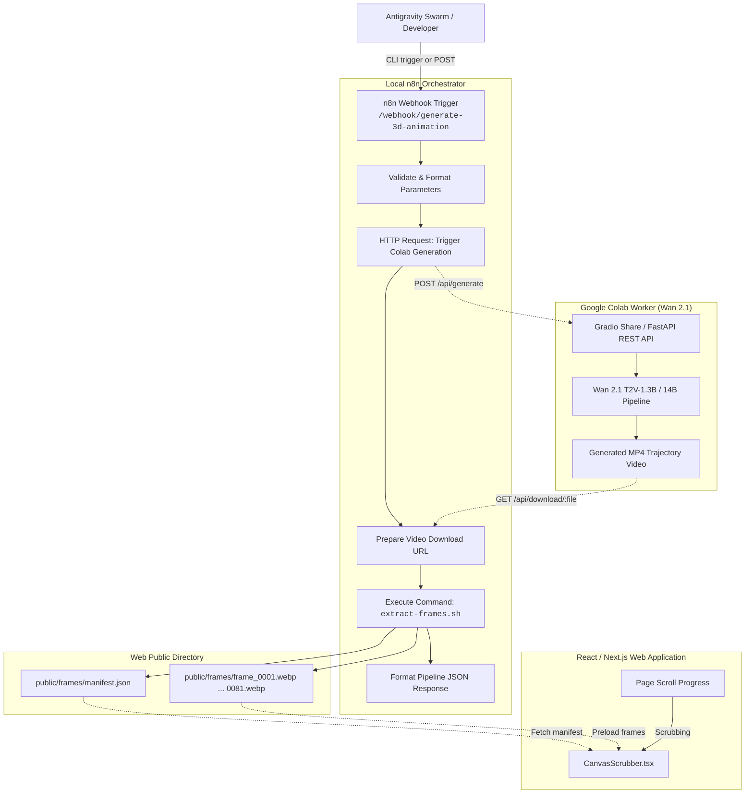

# Wan 2.1 to n8n Web 3D Animation Pipeline Guide

This guide provides step-by-step instructions for generating 3D camera trajectory turnaround animations using **Wan 2.1** on Google Colab, orchestrating generation via **n8n**, extracting WebP frames, and smoothly scrubbing through frames on the frontend using `CanvasScrubber.tsx`.

---

## 1. System Architecture



---

## 2. Prerequisites

1. **Google Colab Account**: Free tier (T4 GPU with 16GB VRAM) or Colab Pro (A100/L4 GPU).
2. **Local n8n Instance**: Running on Docker (e.g. `http://localhost:5678` or local port `5678`).
3. **FFmpeg**: Installed locally on host for slicing frames (`sudo apt-get install -y ffmpeg`).
4. **Environment Variables**:
   - `WAN2_COLAB_URL`: The public `https://xxxxxxxx.gradio.live` endpoint generated by Colab.
   - `N8N_API_URL` & `N8N_API_KEY`: Configured if managing workflows via the n8n API client.

---

## 3. Step 1: Launch Google Colab Worker

### Option A: Using the Jupyter Notebook
1. Open [`notebooks/wan2_colab_worker.ipynb`](../notebooks/wan2_colab_worker.ipynb) in Google Colab.
2. Select runtime: **Runtime → Change runtime type → T4 GPU** (or A100 GPU).
3. Run all cells sequentially.
4. Cell 4 launches the Gradio worker with `--share` mode and outputs a public URL:
   ```text
   Running on public URL: https://3b12c8a9f0e4.gradio.live
   ```

### Option B: Command-Line on Colab / Remote GPU Instance
```bash
git clone https://github.com/Ha-Lun/swarmkit.git
cd swarmkit

# Install dependencies
pip install diffusers transformers accelerate gradio fastapi uvicorn imageio imageio-ffmpeg opencv-python sentencepiece

# Run worker (defaults to Wan2.1-T2V-1.3B)
python scripts/wan2_colab_worker.py --share --port 7860
```

#### Camera Trajectory Presets Supported:
| Preset | Description | Recommended Frames |
| :--- | :--- | :--- |
| `orbit_360` | Full 360° circular turntable orbit around central subject | 81 frames |
| `orbit_180` | 180° semicircular front-to-side profile arc | 81 frames |
| `pan_left` | Smooth leftwards horizontal sliding tracking shot | 65 frames |
| `pan_right` | Smooth rightwards horizontal sliding tracking shot | 65 frames |
| `tilt_up` | Vertical tilt from ground angle to high angle | 65 frames |
| `tilt_down` | Vertical tilt from high angle downwards | 65 frames |
| `zoom_in` | Dolly / push in towards subject close-up | 65 frames |
| `zoom_out` | Dolly / pull out revealing surroundings | 65 frames |
| `spiral` | Dynamic helical ascending 3D fly-around | 81 frames |

---

## 4. Step 2: Import and Configure n8n Workflow

1. Open your n8n web interface (e.g. `http://localhost:5678`).
2. Navigate to **Workflows → Import from File** and select [`workflows/wan2_3d_animation_pipeline.json`](../workflows/wan2_3d_animation_pipeline.json).
3. (Optional) Alternatively, import programmatically using `skill/n8n-api`:
   ```bash
   python skill/n8n-api/scripts/n8n_client.py create-workflow < workflows/wan2_3d_animation_pipeline.json
   ```
4. Configure the Colab endpoint:
   - Either set the `WAN2_COLAB_URL` environment variable in your n8n Docker configuration:
     ```env
     WAN2_COLAB_URL=https://xxxxxxxx.gradio.live
     ```
   - Or pass `colab_url` dynamically in the POST payload when triggering the workflow.
5. Activate the workflow so the webhook endpoint is live:
   `POST /webhook/generate-3d-animation`

---

## 5. Step 3: Trigger 3D Generation

### Using the CLI Trigger Script
You can trigger animations using [`scripts/trigger-3d-animation.sh`](../scripts/trigger-3d-animation.sh):

```bash
# Basic 360 orbit generation via n8n
./scripts/trigger-3d-animation.sh \
  --prompt "futuristic cybernetic sports car, obsidian carbon fiber body, neon blue trim" \
  --camera orbit_360 \
  --colab-url "https://3b12c8a9f0e4.gradio.live"

# High-resolution pan shot into custom project directory
./scripts/trigger-3d-animation.sh \
  --prompt "ancient robotic artifact covered in glowing moss" \
  --camera pan_left \
  --resolution 1280x720 \
  --output-dir "/home/ha-lun/opencode-config/public/frames"

# Direct mode (bypasses n8n and calls Colab Gradio endpoint directly)
./scripts/trigger-3d-animation.sh \
  --prompt "cyberpunk flying drone" \
  --camera orbit_360 \
  --colab-url "https://3b12c8a9f0e4.gradio.live" \
  --direct
```

### Using cURL Directly to n8n Webhook
```bash
curl -X POST http://localhost:5678/webhook/generate-3d-animation \
  -H "Content-Type: application/json" \
  -d '{
    "prompt": "mechanical dragon head, intricate gears, bronze and steel",
    "camera_motion": "orbit_360",
    "resolution": "832x480",
    "frame_count": 81,
    "fps": 30,
    "colab_url": "https://3b12c8a9f0e4.gradio.live",
    "output_dir": "/home/ha-lun/opencode-config/public/frames"
  }'
```

#### Expected Webhook Response:
```json
{
  "success": true,
  "message": "3D camera trajectory frames generated and extracted successfully.",
  "prompt": "mechanical dragon head, intricate gears, bronze and steel",
  "cameraMotion": "orbit_360",
  "resolution": "832x480",
  "frameCount": 81,
  "outputDirectory": "/home/ha-lun/opencode-config/public/frames",
  "manifestPath": "/home/ha-lun/opencode-config/public/frames/manifest.json",
  "manifest": {
    "frameCount": 81,
    "width": 832,
    "height": 480,
    "fps": 30,
    "format": "webp",
    "framePattern": "frame_%04d.webp",
    "samplePath": "frame_0001.webp",
    "generatedAt": "2026-09-11T11:27:34Z"
  }
}
```

---

## 6. Step 4: Frontend Integration with CanvasScrubber

The generated output directory contains:
- `frame_0001.webp` through `frame_0081.webp`
- `manifest.json`

[`components/CanvasScrubber.tsx`](../components/CanvasScrubber.tsx) can load metadata automatically from `manifest.json` or legacy frame count and path functions.

### React / Next.js Implementation:

```tsx
import CanvasScrubber from '@/components/CanvasScrubber';

export default function ProductHero() {
  return (
    <main className="w-full min-h-[300vh] bg-neutral-950 text-white">
      {/* Sticky viewport container */}
      <section className="sticky top-0 h-screen w-full flex items-center justify-center">
        <CanvasScrubber
          manifestUrl="/frames/manifest.json"
          className="rounded-xl shadow-2xl border border-neutral-800"
        />
        
        {/* Foreground scroll overlay elements */}
        <div className="absolute inset-0 pointer-events-none flex flex-col justify-between p-12">
          <h1 className="text-4xl font-bold tracking-tight">Wan 2.1 3D Turnaround</h1>
          <p className="text-neutral-400 text-sm">Scroll down to inspect full 360° geometry</p>
        </div>
      </section>
    </main>
  );
}
```

### Direct Frame Path (Fallback mode):
```tsx
<CanvasScrubber
  frameCount={81}
  framePath={(i) => `/frames/frame_${String(i).padStart(4, '0')}.webp`}
/>
```

---

## 7. Frame Extraction Standalone Helper

The extraction script [`scripts/extract-frames.sh`](../scripts/extract-frames.sh) can also be used independently on any MP4 video:

```bash
./scripts/extract-frames.sh <input.mp4> [output_dir] [format] [fps] [quality]

# Example:
./scripts/extract-frames.sh /tmp/my_video.mp4 public/frames webp 30 90
```

---

## 8. Troubleshooting & FAQ

### 1. Colab Gradio Share link expired
- Free Gradio share links (`.gradio.live`) remain active for **72 hours** as long as the Colab session stays running.
- If the session restarts, rerun the Colab notebook and update the `WAN2_COLAB_URL` with the new share link.

### 2. CUDA Out of Memory (OOM) on Colab
- The worker script enables `enable_model_cpu_offload()` and `enable_vae_tiling()` automatically when VRAM is under 20GB.
- Recommended resolution on free T4 (16GB): `832x480`.
- For `1280x720` or the 14B model, use Colab Pro A100.

### 3. n8n HTTP Request Node Timeout
- Video generation takes approximately **90 - 180 seconds** on GPU.
- The `Call Wan2.1 Colab Worker` node has a configured timeout of **360,000 ms (6 minutes)** to accommodate generation without socket drops.

### 4. Offline / Local Testing Without GPU
- The Colab worker includes a built-in procedural 3D mock engine (`--mock` or when CUDA is not present).
- You can test the entire pipeline locally:
  ```bash
  python scripts/wan2_colab_worker.py --mock --port 7860
  ```
  The mock generator will render rotating 3D wireframes with HUD overlays, allowing testing of n8n webhook routing, frame extraction, and `CanvasScrubber.tsx` without requiring cloud GPUs.
